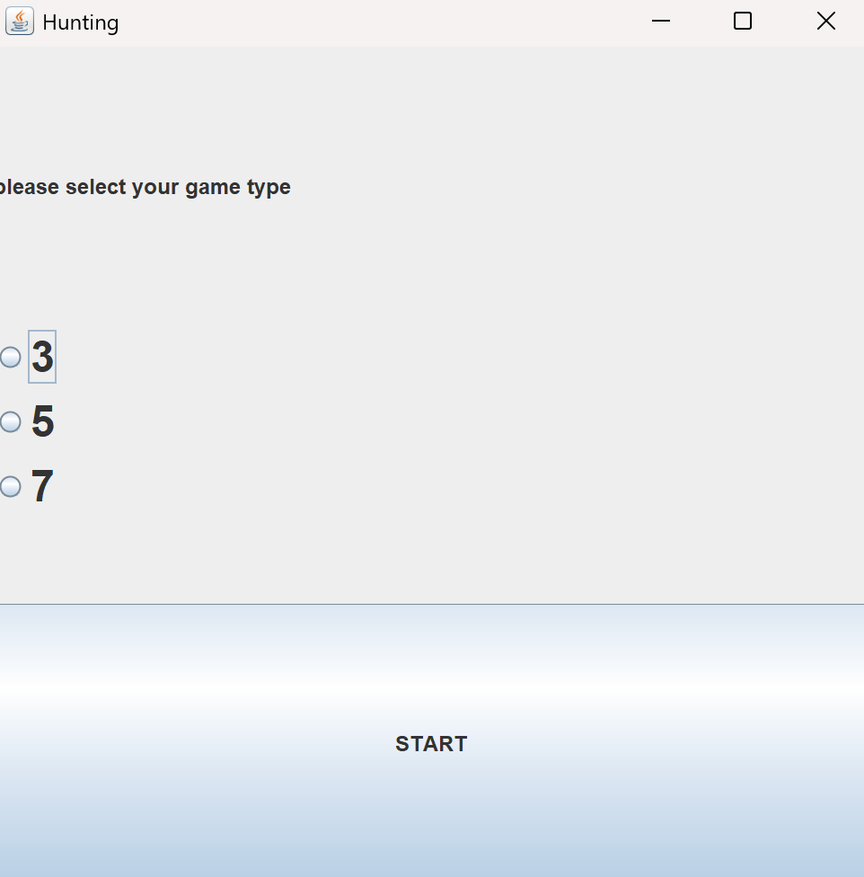
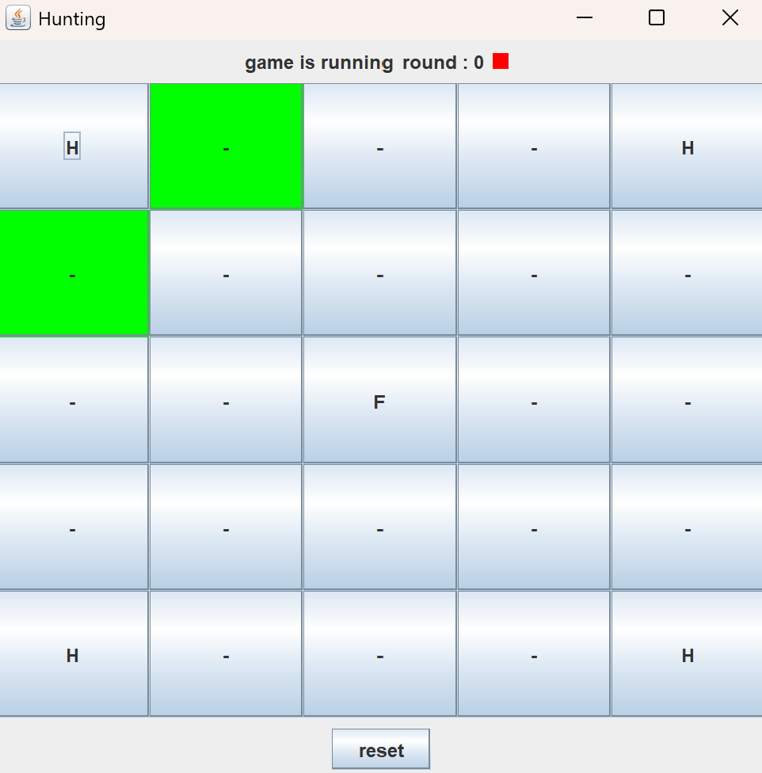
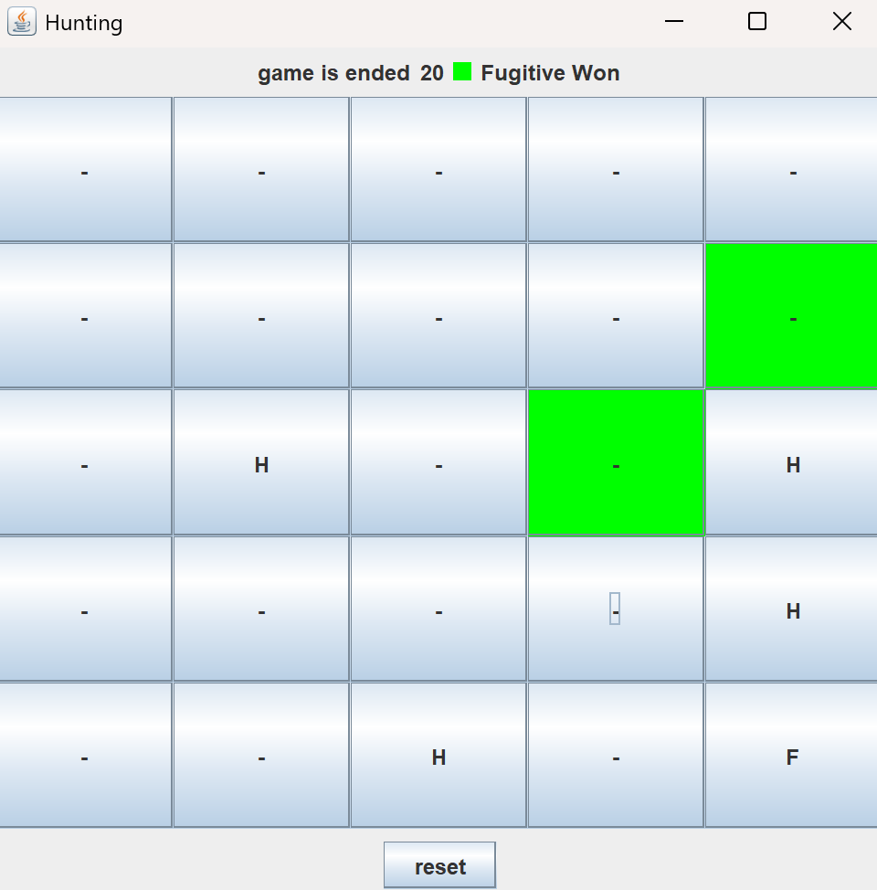
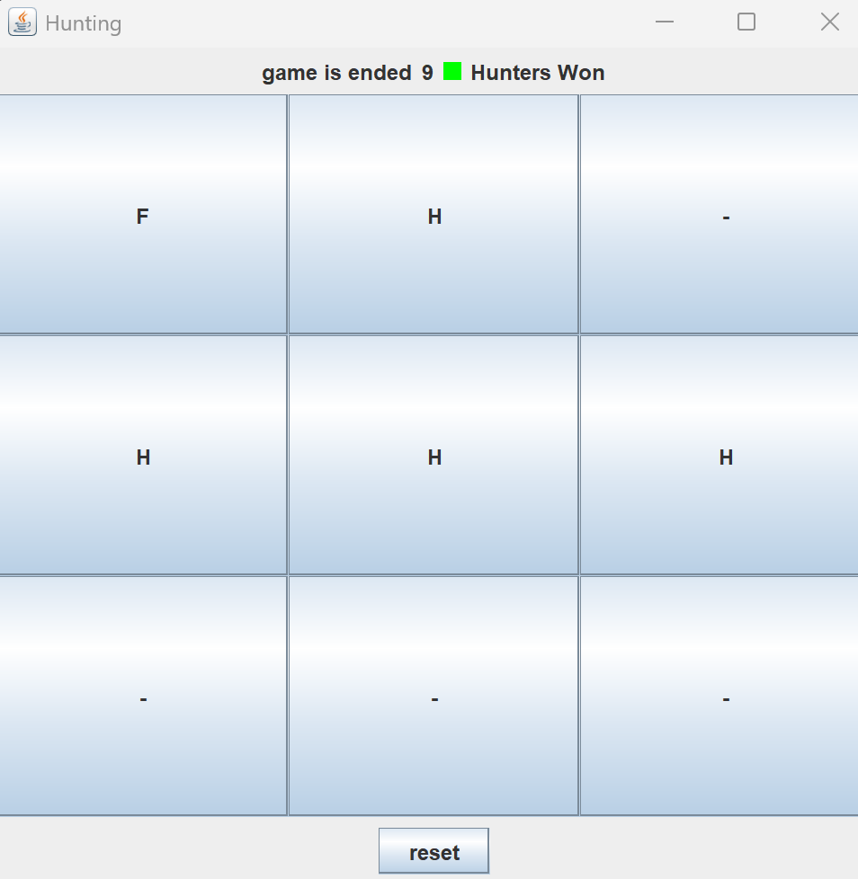

# Hunting Game (Semester 3 - Java GUI Project)

## 🎯 Description

**Hunting** is a **two-player** strategic board game implemented in **Java** as a GUI application. Developed for a **university Programming Technology assignment (Semester 3)**, it simulates a chase scenario between a **fugitive** and a team of **hunters** on an `n x n` board. The game is fully playable with user interaction, win detection, and automatic game reset.

---
## 📸 Screenshots

### 🧭 Main Menu  


### 🗺️ Gameplay Example (5×5 Board)  


### 🏆 Fugitive Victory  


### 🧿 Hunters Victory  



---

## 🧠 Game Concept

- **Players:**  
  - `Fugitive (Player 1)` – Starts at the **center** of the board.
  - `Hunter (Player 2)` – Controls **four hunters**, each starting from a **corner**.

- **Objective:**  
  - The **fugitive** must **avoid capture**.  
  - The **hunter** must **trap the fugitive** within **4 × n turns**.

- **Board Sizes:**  
  - `3x3` → 12 turns  
  - `5x5` → 20 turns  
  - `7x7` → 28 turns  

- **Movement Rules:**  
  - Each turn, players move one step in any legal direction.  
  - Characters **cannot step on each other**.  
  - Hunters choose **which of the 4 pieces** to move.

- **Victory Conditions:**  
  - If the **fugitive is surrounded**, **hunter wins**.  
  - If **4n moves** pass and fugitive is not trapped, **fugitive wins**.  
  - Game **automatically resets** after declaring a winner.

---

## 💻 Features

- ✅ Selectable board sizes (3×3, 5×5, 7×7)
- ✅ Fully GUI-based game loop using Java Swing
- ✅ Turn-based logic between two players
- ✅ Victory condition detection and automatic game reset
- ✅ Informative popup message when game ends
- ✅ Code written with modularity and OOP design
- ✅ Includes **unit tests** for core logic classes

---

## 📂 Project Structure

```
gui-java-hunting-university/
├─ src/
│  ├─ hunting/
│  │  ├─ Board.java              # Board setup and painting
│  │  ├─ Cell.java               # Cell logic (free, occupied, etc.)
│  │  ├─ Character.java          # Abstract class for game pieces
│  │  ├─ Fugitive.java           # Fugitive logic and movement
│  │  ├─ Hunter.java             # Hunter logic and movement
│  │  ├─ Main.java               # Main class launching the GUI
│  │  ├─ Game.java               # Game state and logic manager
│  │  ├─ Position.java           # Utility class for row/column storage
│  │  └─ Utils.java              # Helper functions
│
├─ test/
│  └─ hunting/
│     ├─ GameTest.java           # Unit tests for game logic
│     └─ PositionTest.java       # Unit tests for position handling
├─ README.md
├─ LICENSE
└─ .gitignore
```

---

## 🏁 Example Game Flow

1. Launch the game.
2. Select a board size.
3. Alternate turns between Fugitive and Hunter.
4. Try to trap or escape!
5. A message box will declare the winner.
6. A new game automatically starts.

---
## 📚 University Info

🎓 Student: Saeed Khanloo  
🧠 Course: Programming Technology  
🗓️ Semester: 3  
🪪 License: MIT
